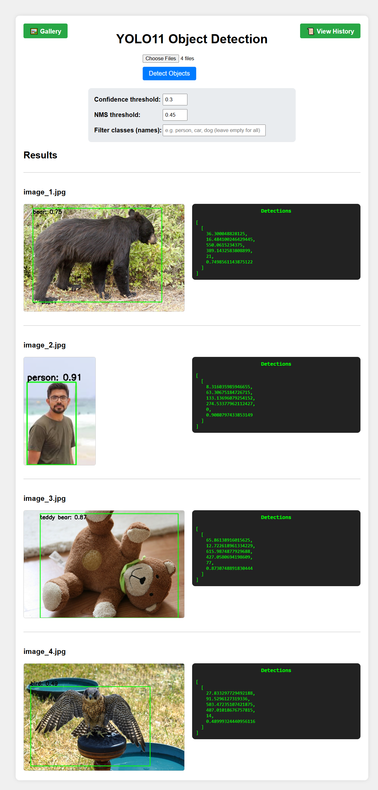
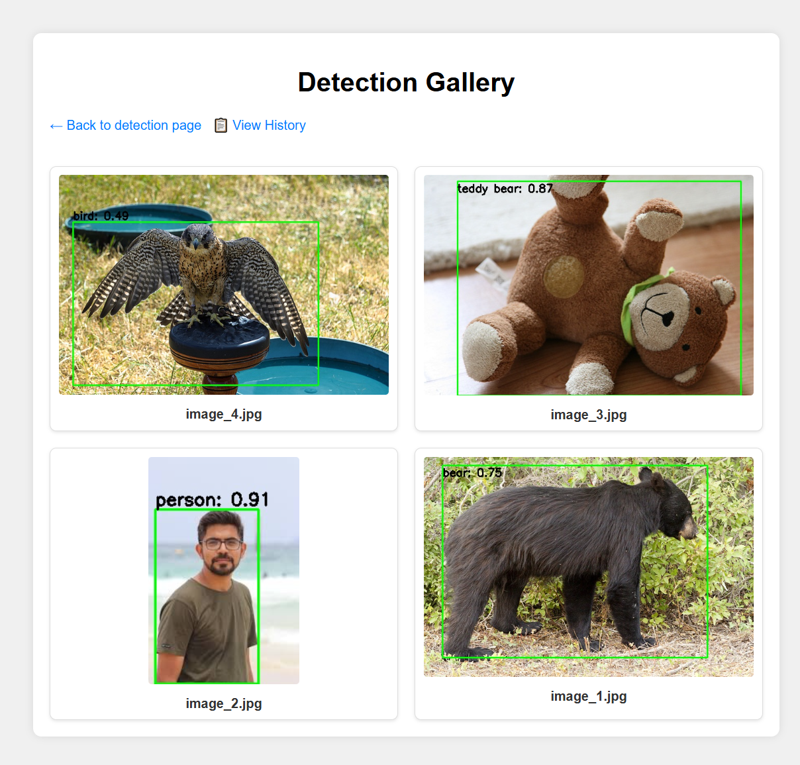
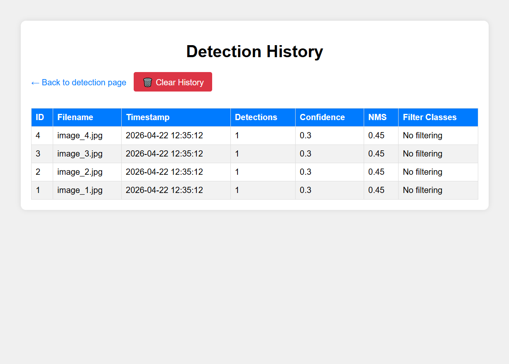
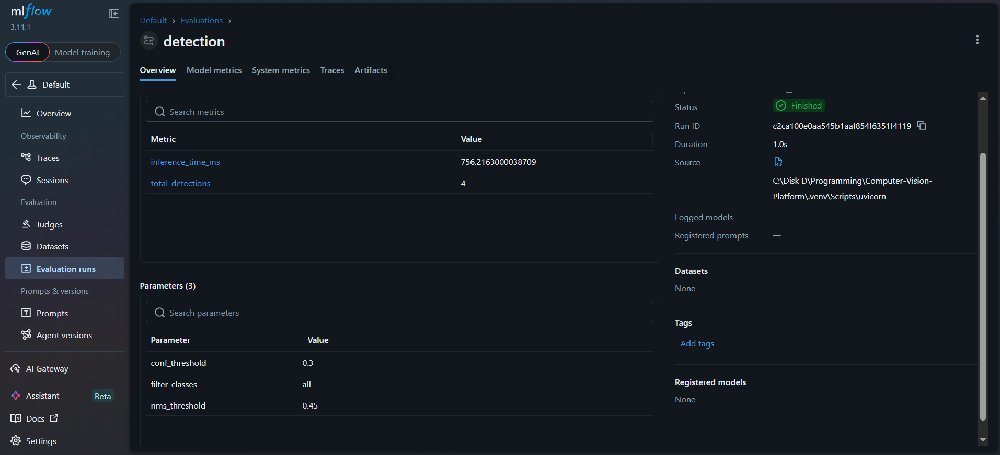

# CV Detection Platform

FastAPI + ONNX Runtime + MySQL based object detection API.

## Prerequisites:
- MySQL (installed and running)
- Python 3.10+

## Setup Instructions

### 1. Clone the repository
```bash
git clone https://github.com/aliaksandrmarchuk369/Computer-Vision-Platform.git
cd cv-detection-platform
```

### 2. Create and activate virtual environment
```bash
python -m venv venv
```

#### On Windows:
```bash
venv\Scripts\activate
```

### 3. Install dependencies
```bash
pip install -e .
pip install -e ".[dev]"  # optional, for testing/linting
```

### 4. Export YOLO model to ONNX

```bash
python scripts/export.py
```

### 5. Run the FastAPI server
```bash
uvicorn main:app --reload
```

If you will get this error 
mysql.connector.errors.DatabaseError: 2003 (HY000): Can't connect to MySQL server on 'localhost:3306' (10061) -> then you need to run following command:
```bash
sc query state= all | findstr /i "mysql"
net start MySQL80 # (Replace MySQL80 with your actual service name)
```

### 6. To observe logged MLflow runs proceed with following command:
```bash
mlflow ui --backend-store-uri ./mlruns # Evaluation Runs
```

## Demo



